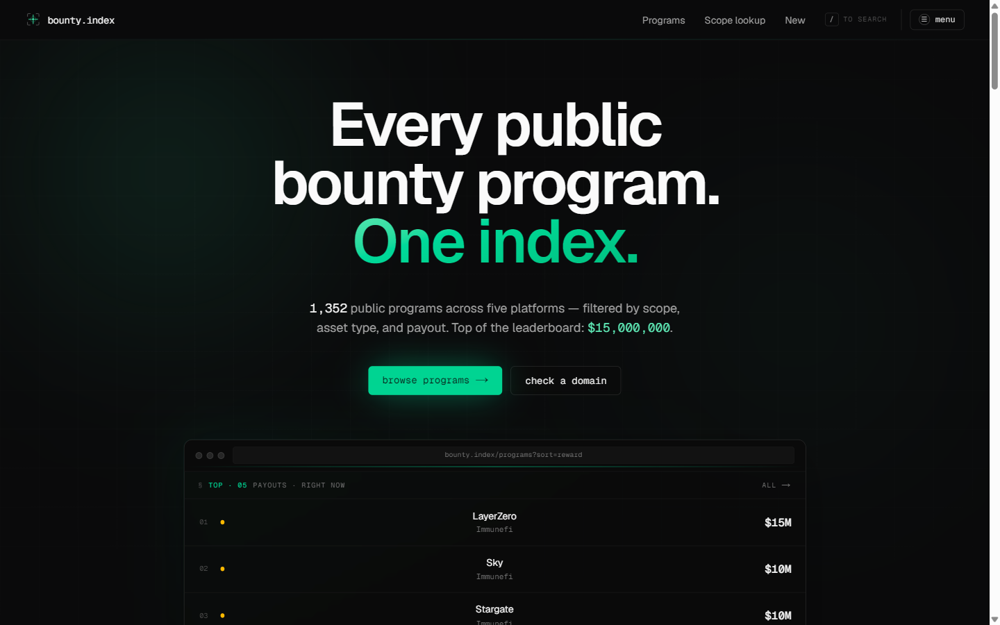
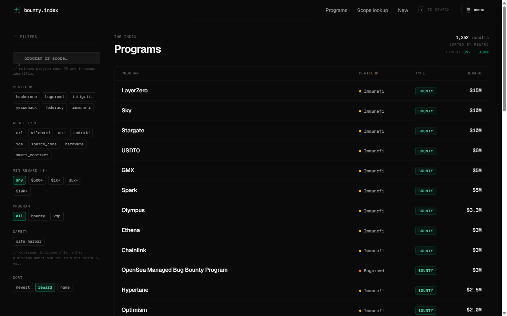
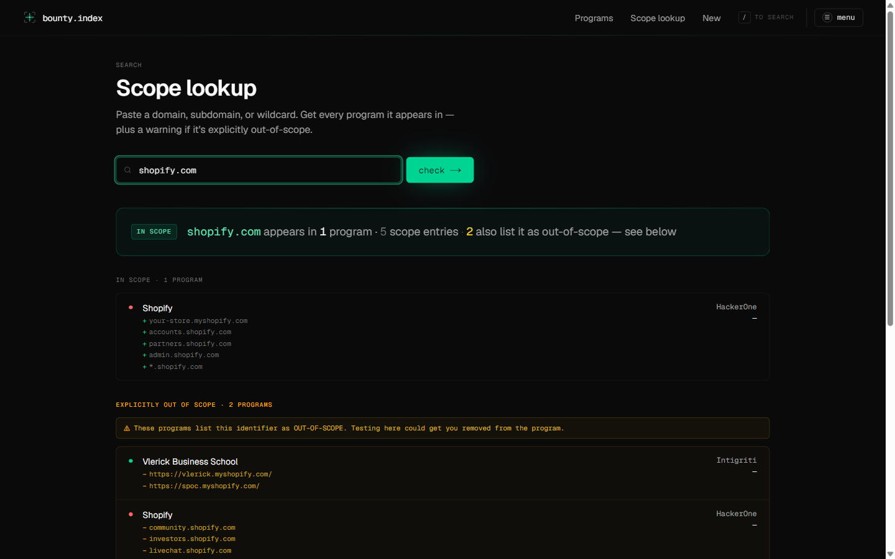
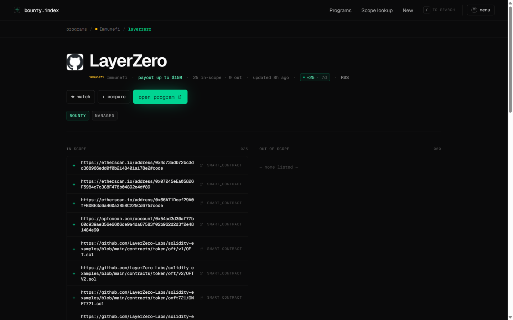

<p align="center">
  <a href="https://www.bountyindex.in">
    
  </a>
</p>

<h1 align="center">bounty.index</h1>

<p align="center">
  <strong>The bug bounty market, live-indexed.</strong><br/>
  Every public program across HackerOne, Bugcrowd, Intigriti, YesWeHack, Federacy, and Immunefi — filtered by scope, asset type, and payout, in one view.
</p>

<p align="center">
  <a href="https://www.bountyindex.in"><strong>bountyindex.in</strong></a> · 1,351 programs · ~50,000 in-scope assets · top payout $15M (LayerZero) · updated daily
</p>

<p align="center">
  <a href="https://www.producthunt.com/products/bounty-index?embed=true&utm_source=badge-featured&utm_medium=badge&utm_campaign=badge-bounty-index" target="_blank" rel="noopener noreferrer"></a>
  &nbsp;
  <a href="https://launchleague.xyz/?product=bounty-index" target="_blank" rel="noopener noreferrer"></a>
</p>

---

## What it is

A single, filterable index of every public bug bounty and VDP program across the six major platforms, with a domain-to-program lookup, daily scope diffs, and per-program RSS. Free. No paywalls on the core index. Sign in only if you want your watchlist to sync across devices.

## Why

Every platform shows only its own programs. Directory sites are stale or policy-only. Raw JSON dumps assume you enjoy `jq`. The one competitor with a real product — [bbradar.io](https://bbradar.io) — paywalls scope-change alerts, RSS, and API behind a €89/yr Pro tier.

bounty.index is the free, polished middle: cross-platform, change-aware, keyboard-first.

| Source | Coverage | Sort by payout | Scope lookup | Change alerts | Cost |
|---|---|---|---|---|---|
| HackerOne / Bugcrowd directories | own only | limited | ✗ | ✗ | free |
| disclose.io | VDP policies only | ✗ | ✗ | ✗ | free |
| `bounty-targets-data` (JSON) | 5 platforms raw | grep + jq | grep + jq | ✗ | free |
| bbradar.io | 24 platforms | ✓ | ✗ | Pro only | €89/yr |
| **bounty.index** | **6 platforms unified** | ✓ | ✓ one query | **per-program RSS, free** | **free** |

## Features

- **Unified index** — one table across HackerOne, Bugcrowd, Intigriti, YesWeHack, Federacy, and Immunefi, sorted by max reward.
- **Scope lookup** — paste a domain, get every program it appears in (in-scope only), with wildcard and identifier matches.
- **Per-program RSS** — every program has a feed of its scope changes at `/rss/programs/{platform}/{slug}`. Point your reader at it and know when scope shifts.
- **7-day activity chip** — a small `+N −M · 7d` indicator on program pages so you can tell dormant from active at a glance.
- **Watchlist & compare** — signed-out uses localStorage, sign-in with GitHub for cross-device sync. Zero email, zero notifications.
- **Filters** — platform, asset type (wildcard, API, mobile, hardware, source), minimum payout, safe-harbor status.
- **Keyboard-first** — `/` focus search, `j`/`k` move rows, `↵` open, `esc` blur.
- **New-programs feed** — dated log at `/feed` + site-wide RSS at `/feed.xml`.
- **Preset landing pages** — bookmarkable filter combos at `/programs/paying`, `/programs/safe-harbor`, `/programs/wildcard`.

## Screenshots

<table>
  <tr>
    <td width="50%">
      <a href="https://www.bountyindex.in/programs"></a>
      <p align="center"><sub><strong>/programs</strong> — filter by platform, asset type, payout, safe-harbor</sub></p>
    </td>
    <td width="50%">
      <a href="https://www.bountyindex.in/scope-lookup?domain=shopify.com"></a>
      <p align="center"><sub><strong>/scope-lookup</strong> — paste a domain, see every program it's in — and the ones that explicitly exclude it</sub></p>
    </td>
  </tr>
  <tr>
    <td colspan="2">
      <a href="https://www.bountyindex.in/programs/immunefi/layerzero"></a>
      <p align="center"><sub><strong>/programs/immunefi/layerzero</strong> — company logo, 7-day activity chip, per-program RSS, split in/out-of-scope</sub></p>
    </td>
  </tr>
</table>

## Stack

- **Next.js 16** (App Router, Fluid Compute) + **TypeScript**
- **Tailwind 4** — dark editorial design system, single-accent emerald
- **Neon Postgres** + **Drizzle ORM**, pg_trgm for fuzzy search
- **Auth.js v5** — GitHub OAuth, database sessions
- **Vercel** — hosting, cron, analytics
- Data sources: [arkadiyt/bounty-targets-data](https://github.com/arkadiyt/bounty-targets-data) (MIT) for five platforms, first-party HTML scrape for Immunefi.
- SHA-256 content-hashed program snapshots for change detection (sparse rows: only when content actually changes).

## Local setup

```bash
git clone https://github.com/Varun2024/Bounty-index.git
cd Bounty-index
npm install
cp .env.example .env    # set DATABASE_URL to a Postgres connection string
npm run db:push         # create tables
npm run ingest          # first data pull (~1,300 programs, ~50k scopes)
npm run dev
```

Open [localhost:3000](http://localhost:3000). GitHub OAuth is optional locally — the localStorage path works signed-out.

### Scripts

| Command | What it does |
|---|---|
| `npm run dev` | Dev server (Turbopack) |
| `npm run dev:webpack` | Dev server (Webpack fallback for Windows Turbopack issues) |
| `npm run build` | Production build |
| `npm run start` | Serve production build |
| `npm run lint` | ESLint |
| `npm run db:push` | Push schema to Postgres |
| `npm run db:generate` | Generate SQL migrations |
| `npm run db:studio` | Drizzle Studio |
| `npm run ingest` | Re-run the ingest job locally |

## Deployment

Deployed on Vercel with:

- `DATABASE_URL` — Neon Postgres connection string
- `CRON_SECRET` — random 32-byte hex for the ingest cron
- `NEXT_PUBLIC_SITE_URL` — canonical site URL (metadataBase, sitemap, robots)
- `AUTH_SECRET`, `AUTH_GITHUB_ID`, `AUTH_GITHUB_SECRET`, `AUTH_URL` — Auth.js + GitHub OAuth

Cron runs daily at 06:00 UTC via `vercel.ts` → `/api/cron/ingest` (Bearer-authenticated). Immunefi ingest uses stage-1 hashing to short-circuit unchanged programs and fit inside the 300s function cap on subsequent runs.

## Roadmap

**Shipped** — six-platform coverage, filters + scope lookup, watchlist + compare with GitHub-OAuth cross-device sync, per-program scope-change RSS, activity chips, snapshot history, editorial dark UI, keyboard nav, preset SEO landing pages.

**Next** — site-wide scope-changelog stream at `/feed/scopes`, algorithmic program opportunity score, coverage expansion (Huntr, HackenProof), watchlist RSS.

**Later** — community reviews, company pages, public API.

**Never** — paywalls on the core index, ads, email alerts (killed permanently in favor of RSS), fake or sponsored programs.

## Product & follow

- Live: [bountyindex.in](https://www.bountyindex.in)
- Product Hunt: [producthunt.com/products/bounty-index](https://www.producthunt.com/products/bounty-index)
- LaunchLeague: [launchleague.xyz/?product=bounty-index](https://launchleague.xyz/?product=bounty-index)
- Built by [Varun](https://varuncodes.tech/) · [@TheV_Stack](https://x.com/TheV_Stack) on X · [Varun2024](https://github.com/Varun2024) on GitHub
- Buy me a coffee: [buymeacoffee.com/varun_builds](https://buymeacoffee.com/varun_builds)

## License

MIT. Data belongs to the respective platforms. Not affiliated with HackerOne, Bugcrowd, Intigriti, YesWeHack, Federacy, Immunefi, or any other platform.
